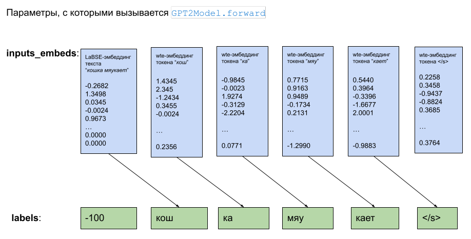

# vector2text

Репозиторий содержит код моего эксперимента с восстановлением русского текста из вектора эмбеддинга с помощью модели GPT.

Векторы предложений получаем с помощью модели [sentence-transformers/LaBSE](https://huggingface.co/sentence-transformers/LaBSE).

Генеративная модель - [sberbank-ai/rugpt3large_based_on_gpt2](https://huggingface.co/sberbank-ai/rugpt3large_based_on_gpt2).

Используемые библиотеки: torch, transformers, sentence-transformers

## Ключевая идея

Код метода [GPT2Model.forward](https://huggingface.co/docs/transformers/en/model_doc/gpt2#transformers.GPT2Model.forward) позволяет
давать на вход вместо цепочки целочисленных индексов токенов их векторы. Предполагается, что эти векторы получаются
через матрицу слоя wte в GPT модели.

Но ничто не мешает нам подавать на вход модели любые другие векторы. Например, можно вместо первого
токена подать **вектор эмбеддинга предложения**, полученный какой-то энкодерной моделью типа LaBSE, а остальные токены
представлять векторами из слоя wte. Изначально GPT ничего не знает о семантике компонентов первого LaBSE-вектора, поэтому
нужно дообучить GPT на примерах.

Вектор эмбеддинга LaBSE имеет размер 768, а эмбеддинги токенов в rugpt3large_based_on_gpt2 - 1536. Я просто дополняю LaBSE-вектор нулями до 1536.

Визуальное пояснение схемы:



## Авторегрессионная генерация из LaBSE-вектора

Алгоритм генерации с помощью дообученной модели выглядит так. У нас есть LaBSE-совместимый вектор, который мы хотим раскрыть до текста.
Этот вектор задаем в качестве затравки, в аргумент inputs_embeds, и делаем первый шаг сэмплинга. Получаем первый токен теста. Этот токен
прогоняем через слой wte в GPT и получаем вектор, который становится вторый строкой в подаваемый в inputs_embeds тензор. Шаги сэмплинга
повторяем до генерации токена </s>. Реализующий этот алгоритм код можно [увидеть тут](https://github.com/Koziev/vector2text/blob/main/generate_text_from_embedding_vector.py#L122).

## Примеры генерации

По мере файнтюна код периодически вычисляет тестовый лосс на отдельном подмножестве сэмплов, а также
выводит несколько генераций, чтобы визуально отслеживать прогресс. Сначала модель не учитывает LaBSE-вектор,
но постепенно генерации начинают приближаться по смыслу, а потом и по лексике, к исходному тексту:

```
замечательно! ==> отлично!
Тема переросла во флуд ==> Вопрос трансформировался в шутку
Где лодка? ==> Где лодка?
У вас есть огород? ==> У вас есть сад?
Я бы ехал автобусом. ==> Я бы поехал автобусом.
Я ничуточки не боялась. ==> Я ни капельки не боялся.
Где много диких обезьян? ==> Где водится много диких обезьян?
```

## Код

Весь код подготовки данных и обучения находится в [generate_text_from_embedding_vector.py](generate_text_from_embedding_vector.py).

В репозитории также есть небольшой файл с предложениями, чтобы можно было запустить обучение сразу. Но настоятельно рекомендую расширить файл texts.txt как минимум до полумиллиона предложений.


## TODO

1) В коде сейчас нет сохранения обученной модели для последующего использования.

2) Код генерации из вектора нужно выделить из [generate_text_from_embedding_vector.py]() в отдельный модуль для
удобства использования с п.1
